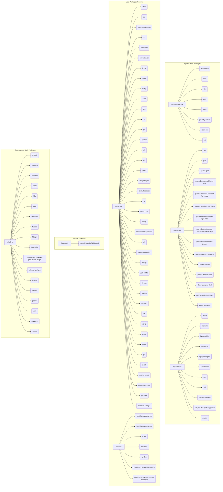

```mermaid
graph TD
    subgraph System-wide Packages
        config_nix["configuration.nix"]
        gnome_nix["gnome.nix"]
        hyprland_nix["hyprland.nix"]

        config_nix --> lsb_release(lsb-release)
        config_nix --> sops(sops)
        config_nix --> vim(vim)
        config_nix --> wget(wget)
        config_nix --> restic(restic)
        config_nix --> pinentry_curses(pinentry-curses)
        config_nix --> rocm_smi(rocm-smi)
        config_nix --> nil(nil)
        
        gnome_nix --> gjs(gjs)
        gnome_nix --> gvfs(gvfs)
        gnome_nix --> gnome_gvfs(gnome.gvfs)
        gnome_nix --> blur_my_shell(gnomeExtensions.blur-my-shell)
        gnome_nix --> bluetooth_file_sender(gnomeExtensions.bluetooth-file-sender)
        gnome_nix --> gsconnect(gnomeExtensions.gsconnect)
        gnome_nix --> night_light_slider(gnomeExtensions.night-light-slider)
        gnome_nix --> user_avatar(gnomeExtensions.user-avatar-in-quick-settings)
        gnome_nix --> user_themes(gnomeExtensions.user-themes)
        gnome_nix --> browser_connector(gnome-browser-connector)
        gnome_nix --> gnome_tweaks(gnome-tweaks)
        gnome_nix --> themes_extra(gnome-themes-extra)
        gnome_nix --> chrome_gnome_shell(chrome-gnome-shell)
        gnome_nix --> gnome_shell_extensions(gnome-shell-extensions)
        gnome_nix --> kora_icon_theme(kora-icon-theme)
        
        hyprland_nix --> dunst(dunst)
        hyprland_nix --> hyprutils(hyprutils)
        hyprland_nix --> hyprgraphics(hyprgraphics)
        hyprland_nix --> hyprpaper(hyprpaper)
        hyprland_nix --> hyprpolkitagent(hyprpolkitagent)
        hyprland_nix --> pavucontrol(pavucontrol)
        hyprland_nix --> rbw(rbw)
        hyprland_nix --> rofi(rofi)
        hyprland_nix --> rofi_rbw_wayland(rofi-rbw-wayland)
        hyprland_nix --> xdg_desktop_portal_hyprland(xdg-desktop-portal-hyprland)
        hyprland_nix --> waybar(waybar)
    end

    subgraph User Packages for mike
        home_nix["home.nix"]
        helix_nix["helix.nix"]
        
        home_nix --> atuin(atuin)
        home_nix --> bat(bat)
        home_nix --> batman(bat-extras.batman)
        home_nix --> bfs(bfs)
        home_nix --> bitwarden(bitwarden)
        home_nix --> bitwarden_cli(bitwarden-cli)
        home_nix --> brave(brave)
        home_nix --> cargo(cargo)
        home_nix --> clang(clang)
        home_nix --> delta(delta)
        home_nix --> eza(eza)
        home_nix --> fd(fd)
        home_nix --> gh(gh)
        home_nix --> ghostty(ghostty)
        home_nix --> git(git)
        home_nix --> go(go)
        home_nix --> gtrash(gtrash)
        home_nix --> imagemagick(imagemagick)
        home_nix --> jdk21_headless(jdk21_headless)
        home_nix --> jq(jq)
        home_nix --> lazydocker(lazydocker)
        home_nix --> lazygit(lazygit)
        home_nix --> networkmanagerapplet(networkmanagerapplet)
        home_nix --> nh(nh)
        home_nix --> nom(nix-output-monitor)
        home_nix --> nodejs(nodejs)
        home_nix --> python313(python313)
        home_nix --> ripgrep(ripgrep)
        home_nix --> screen(screen)
        home_nix --> starship(starship)
        home_nix --> tldr(tldr)
        home_nix --> ugrep(ugrep)
        home_nix --> unzip(unzip)
        home_nix --> viddy(viddy)
        home_nix --> yq(yq)
        home_nix --> zoxide(zoxide)
        home_nix --> gnome_boxes(gnome-boxes)
        home_nix --> blame_line_pretty(blame-line-pretty)
        home_nix --> git_hunk(git-hunk)
        home_nix --> androidmessages(androidmessages)
        
        helix_nix --> yaml_ls(yaml-language-server)
        helix_nix --> bash_ls(bash-language-server)
        helix_nix --> shfmt(shfmt)
        helix_nix --> alejandra(alejandra)
        helix_nix --> yamlfmt(yamlfmt)
        helix_nix --> autopep8(python313Packages.autopep8)
        helix_nix --> python_lsp(python313Packages.python-lsp-server)
    end

    subgraph Flatpak Packages
        flatpak_nix["flatpak.nix"]
        flatpak_nix --> flatseal(com.github.tchx84.Flatseal)
    end

    subgraph Development Shell Packages
        shell_nix["shell.nix"]
        
        shell_nix --> awscli2(awscli2)
        shell_nix --> azure_cli(azure-cli)
        shell_nix --> cilium_cli(cilium-cli)
        shell_nix --> cmctl(cmctl)
        shell_nix --> k9s(k9s)
        shell_nix --> kops(kops)
        shell_nix --> kubeseal(kubeseal)
        shell_nix --> hubble(hubble)
        shell_nix --> k8sgpt(k8sgpt)
        shell_nix --> kustomize(kustomize)
        shell_nix --> gcloud_auth(google-cloud-sdk.gke-gcloud-auth-plugin)
        shell_nix --> helm(kubernetes-helm)
        shell_nix --> kubectl(kubectl)
        shell_nix --> kubectx(kubectx)
        shell_nix --> packer(packer)
        shell_nix --> vault(vault)
        shell_nix --> terraform(terraform)
        shell_nix --> neovim(neovim)
    end
```
